# 📈 Stocks Tracker
<table>
  <tr>
    <td>
      <table>
        <tr>
          <th style="text-align:center;">Status</th>
        </tr>
        <tr>
          <td></td>
        </tr>
        <tr>
          <td></td>
        </tr>
        <tr>
          <td></td>
        </tr>
        <tr>
          <td></td>
        </tr>
      </table>
    </td>
    <td>
      <table>
        <tr>
          <th>Component</th>
          <th>Tech Stack</th>
        </tr>
        <tr>
          <td>Ingestion</td>
          <td></td>
        </tr>
        <tr>
          <td>Database</td>
          <td></td>
        </tr>
        <tr>
          <td>Containerization</td>
          <td></td>
        </tr>
        <tr>
          <td>Orchestration</td>
          <td></td>
        </tr>
        <tr>
          <td>Message Queue</td>
          <td></td>
        </tr>
      </table>
    </td>
  </tr>
</table>


## Overview
The Stocks Tracker project is a small PoC showcasing the extraction, processing, and storage of OHLC (Open, High, Low, Close) data for the top 50 US stocks. The system leverages microservices architecture, containerization with docker, container orchestration through Kubernetes, and message queuing for seamless operation.

## 📐 High Level System Design

### 1. Data Ingestion (Ingestor)
The Data Ingestion component is responsible for extracting OHLC data for the top 50 US stocks at hourly intervals. This is achieved through scheduled cron jobs. The extracted data is then formatted and forwarded to the RabbitMQ message queue for further processing.

### 2. PostgreSQL Database (Database)
The PostgreSQL Database container stores the OHLC data received from the FastAPI Microservice. It maintains data integrity and provides a reliable storage solution for financial data.

### 3. Database Server API (DB Server)
The FastAPI Microservice (DB Server) is responsible for handling incoming requests and interacting with the PostgreSQL Database. It provides an external interface via REST API to read and write OHLC data. The microservice communicates with the PostgreSQL Database container to store and retrieve data.

### 4. Message Queue (RabbitMQ)
The RabbitMQ message queue acts as a decoupling mechanism between the Ingestor and the Database Server. It ensures robust and asynchronous communication. Extracted data from the Ingestor is transmitted through the queue to the Database Server for storage.

```mermaid
  graph LR
    subgraph A[Ingestion]
        direction RL
        style A fill:#1f2020,stroke:#81B1DB,stroke-width:2px,fontSize:20px
        subgraph Ingestor
            F(fa:fa-gear Cronjob)
            G(fa:fa-gear Cronjob)
        end
        F --->|Fetch Data| E[External APIs fa:fa-globe]
        G --->|Fetch Data| E
    end
    
    subgraph data[Data Layer]
        direction TB
        style data fontSize:20
        C[DB Server] --> D[(Database)]
    end

    A -....->|Optional direct access| data
    A --->|Publish| B[[RABBITMQ]] ---> |Consume| data

    subgraph K8s[Kubernetes Cluster]
        style K8s fill:none, fontSize:20px
        K((Kubernetes\nfa:fa-dharmachakra))
        K --x A
        K --x B
        K --x data
    end
```



## 🚀 Local Setup Instructions
### Clone the repository
- Clone the repository using the following command:
```bash
git clone
```

### Setup Kubernetes Cluster
- You can download Docker Desktop from [here](https://www.docker.com/products/docker-desktop) and follow the instructions to install it on your machine. The latest version of Docker Desktop comes with Kubernetes support. You can enable Kubernetes from the Docker Desktop settings.
- Once you have Docker Desktop installed, you can setup a local Kubernetes cluster by following the instructions [here](https://docs.docker.com/desktop/kubernetes/).
- You can verify that the cluster is up and running by running the following command:
```bash
kubectl get nodes
```
- You should see similar output:
```bash
NAME             STATUS   ROLES                  AGE   VERSION
docker-desktop   Ready    control-plane,master   1h   v1.27.2
```

### Setup ConfigMaps and Secrets
- You first need to create `.env` files as per the `.env.sample` files in the `ingestion` and `db-server` directories.
- The `.env` files contain the environment variables required by the microservices.
- You can create the `.env` files by running the following commands:
```bash
cp ingestion/.env.sample ingestion/.env
cp db-server/.env.sample db-server/.env
```
- You can then update the `.env` files with the required values.
- You can then create the following Kubernetes ConfigMaps:
    1. `db-config`
    2. `db-server-config`
    3. `ingestion-config`
    4. `rabbitmq-config`
    5. `init-script-config`
    6. `db-secrets`
    7. `db-server-secrets`
    8. `ingestion-secrets`
    9. `rabbitmq-secrets`

- You can then create the ConfigMaps by running the following commands:
```bash
kubectl create configmap db-config --from-env-file=database/.env
kubectl create configmap db-server-config --from-env-file=database/.env
kubectl create configmap ingestion-config --from-env-file=ingestion/.env
kubectl create configmap rabbitmq-config --from-env-file=rabbitmq/.env
kubectl create configmap init-script-config --from-file=database/init.sql
```
- For the secrets, you first need to create a `.secrets` folder and populate it with the following files:
    1. `DATABASE_PASSWORD`
    2. `RABBITMQ_PASSWORD`
    3. `TWELVEDATA_API_KEY_1`
    4. `TWELVEDATA_API_KEY_2`
    Populate the files with the required values.
- You can then create the Secrets by running the following commands:
```bash
kubectl create secret generic db-secrets \
    --from-file=POSTGRES_PASSWORD=.secrets/DATABASE_PASSWORD
kubectl create secret generic db-server-secrets \
    --from-file=DATABASE_PASSWORD=.secrets/DATABASE_PASSWORD
    --from-file=RABBITMQ_PASSWORD=.secrets/RABBITMQ_PASSWORD
kubectl create secret generic rabbitmq-secrets \
    --from-file=RABBITMQ_DEFAULT_PASS=.secrets/RABBITMQ_PASSWORD
kubectl create secret generic ingestion-secrets \
    --from-file=TWELVEDATA_API_KEY_1=.secrets/TWELVEDATA_API_KEY_1
    --from-file=TWELVEDATA_API_KEY_2=.secrets/TWELVEDATA_API_KEY_2
    --from-file=RABBITMQ_PASSWORD=.secrets/RABBITMQ_PASSWORD
```
- You can verify that the ConfigMaps and Secrets have been created by running the following commands:
```bash
kubectl get configmaps
kubectl get secrets
```
- You should see similar output:
```bash
NAME                     DATA   AGE
db-config                3      1m
db-server-config         3      1m
ingestion-config         3      1m
rabbitmq-config          1      1m
init-script-config       1      1m

NAME                     TYPE        DATA   AGE
db-secrets               Opaque      1      1m
db-server-secrets        Opaque      2      1m
ingestion-secrets        Opaque      3      1m
rabbitmq-secrets         Opaque      1      1m
```

### Run the application
- Now that you have setup the prerequisites, you can run the application.
- Navigate to the root directory of the project and run the following command:
```bash
kubectl apply -f kubernetes
```
- This will create the required deployments, services, and cronjobs in the Kubernetes cluster.
- You can verify that the pods are up and running by running the following command:
```bash
kubectl get pods
```
- You should see similar output:
```bash
NAME                            READY   STATUS    RESTARTS   AGE
database-statefulset-0                  1/1     Running     0          1m
db-server-deployment-6964784d46-chpn6   1/1     Running     0          1m
ingestion-cronjob-a-28208760-8rjs6      0/1     Completed   0          1m
ingestion-cronjob-b-28208820-5d5kg      0/1     Completed   0          1m
rabbitmq-statefulset-0                  1/1     Running     0          1m
```
- You can manually trigger the ingestion cronjobs by running the following commands:
```bash
kubectl create job --from=cronjob/ingestion-cronjob-a ingestion-job
```
- You can verify that the jobs have been created by running the following command:
```bash
kubectl get jobs
```
- You should see similar output:
```bash
NAME            COMPLETIONS   DURATION   AGE
ingestion-job   0/1           1m         1m
```
- You can verify that the data has been ingested by running the following command:
```bash
kubectl exec -it database-statefulset-0 -- psql -U postgres -d stocks -c "SELECT * FROM stocks LIMIT 5;"
```
- You should see similar output:
```bash
      datetime       | timestamp  | ticker |         name         |  open  |  high  |  low   | close  | volume  |   source   
---------------------+------------+--------+----------------------+--------+--------+--------+--------+---------+------------
 2023-08-18 15:30:00 | 1692388746 | AAPL   | Apple Inc            | 174.49 | 175.10 | 174.15 | 174.49 | 6239136 | twelvedata
 2023-08-18 15:30:00 | 1692388746 | MSFT   | Microsoft Corp       | 316.49 | 318.38 | 315.86 | 316.52 | 2947828 | twelvedata
 2023-08-18 15:30:00 | 1692388740 | AMZN   | Amazon.com Inc       | 133.43 | 134.07 | 132.95 | 133.23 | 4880240 | twelvedata
 2023-08-18 15:30:00 | 1692388740 | GOOG   | Alphabet Inc         | 127.90 | 128.70 | 127.79 | 128.12 | 2579661 | twelvedata
 2023-08-18 15:30:00 | 1692388746 | META   | Meta Platforms, Inc. | 283.46 | 285.69 | 282.70 | 283.28 | 5502937 | twelvedata
(5 rows)
```

### 🎉 And that's it! You have successfully setup the Stocks Tracker application in your local Kubernetes cluster.

## 👥 Contributing
This project is a simple PoC and is not actively maintained.\
However, if you would like to contribute, feel free to open a pull request.

### Ways to contribute
- [ ] Report a bug
- [ ] Fix an existing bug
- [ ] Improve test coverage
- [ ] Improve documentation
- [ ] Refactor code
- [ ] Add new features
