# 📈 StocksALot
<table>
  <tr>
    <table>
      <tr>
        <td>
          
        </td>
        <td>
          
        </td>
        <td>
          
        </td>
      </tr>
      <tr>
        <td>
          
        </td>
        <td>
          
        </td>
        <td>
          
        </td>
      </tr>
    </table>
  </tr>
  <tr>
    <table>
      <tr>
        <th>Component</th>
        <th>Tech Stack</th>
        <th>Component</th>
        <th>Tech Stack</th>
      </tr>
      <tr>
        <td>Ingestion</td>
        <td></td>
        <td>Containerization</td>
        <td align=right></td>
      </tr>
      <tr>
        <td>Backend</td>
        <td></td>
        <td>Orchestration</td>
        <td align=right></td>
      </tr>
      <tr>
        <td>Frontend</td>
        <td></td>
        <td>Message Queue</td>
        <td align=right></td>
      </tr>
      <tr>
        <td>Database</td>
        <td></td>
        <td>Cache</td>
        <td align=right></td>
      </tr>
    </table>
  </tr>
</table>


## Overview
StocksALot is a cutting edge PoC for Stock Market Analysis employing OpenAI's GPT LLMs for insight inference.


* The backend is powered by FastAPI serving the multiple roles:
  * Communication with a PostgreSQL database
  * Interacting with OpenAI's GPT models to infer insights from the OHLC data
  * Authenticator for external API access
* The lightweight Frontend is written in TypeScript and compiled by Sveltekit.
* The data ingestion component is written in pure Python and work asynchronously as Cronjobs.
* For seamless communication between data ingestion and data storage, a RabbitMQ message broker is employed.
* To prevent excessive API calls, a Redis cache is used to store the OHLC data for faster retrieval.
* The entire application is containerized using Docker and orchestrated using Kubernetes.

## 📐 High Level System Design

### 1. Data Ingestion (Ingestor)
The Data Ingestion component is responsible for extracting OHLC data for the top 50 US stocks at hourly intervals. This is achieved through scheduled cron jobs. The extracted data is then formatted and forwarded to the RabbitMQ message queue for further processing.

### 2. PostgreSQL Database (Database)
The PostgreSQL Database container stores the OHLC data received from the FastAPI Microservice. It maintains data integrity and provides a reliable storage solution for financial data.

### 3. Database Server API (DB Server)
The FastAPI Microservice (DB Server) is responsible for handling incoming requests and interacting with the PostgreSQL Database. It provides an external interface via REST API to read and write OHLC data. The microservice communicates with the PostgreSQL Database container to store and retrieve data.
The API is exposed to authenticated users for programmatic access as well as to the Frontend component for displaying the data to the end user.

### 4. Message Queue (RabbitMQ)
The RabbitMQ message queue acts as a decoupling mechanism between the Ingestor and the Database Server. It ensures robust and asynchronous communication. Extracted data from the Ingestor is transmitted through the queue to the Database Server for storage.

### 5. Frontend (Frontend)
Written in SvelteKit, the Frontend component is responsible for providing a user interface to the end user. It communicates with the Database Server to fetch the required data and displays it to the user. It also serves as the portal to register for an API token to access the Database Server API.

### 6. Load Balancer (DB Server Service)
The Load Balancer component is responsible for load balancing incoming requests to the DB server. It supports requests from the Frontend as well as external API Users. Although the diagrams shows it as a separate component, it is technically part of the data layer.

### 7. Cache (Redis)
A Redis cache is used to store the OHLC data for faster retrieval. The Frontend component first checks the cache for the required data and if it is not present, it fetches the data from the Database Server.

### 8. Users
The Users component represents the end users of the application. They can access the Frontend component to view the OHLC data for the top 50 US stocks. They can also register for an API token to access the Database Server API for programmatic access to the data.

```mermaid
  graph LR
    K((Kubernetes\nfa:fa-dharmachakra))
    K -.-x I
    K -.-x data
    K -.-x R
    K -.-x F
    K -.-x LB    
        
    subgraph K8s[Kubernetes Cluster]
      style K8s fill:none

      subgraph Internal[Backend Layer]
        style Internal fill:#111,stroke:#81B1DB

        subgraph I[Ingestion]
            direction RL
            style I fill:#1f2020,stroke:#81B1DB,stroke-width:2px

            subgraph Ingestor
                C1(fa:fa-gear Cronjob)
                C2(fa:fa-gear Cronjob)
            end

            C1 --->|Fetch Data| E1[External APIs fa:fa-globe]
            C1 --->|Fetch Data| E2[External APIs fa:fa-globe]
            C2 --->|Fetch Data| E1
            C2 --->|Fetch Data| E2
        end
        
        subgraph data[Data Layer]
            direction TB
            style data fill:#1f2020,stroke:#81B1DB,stroke-width:2px

            DS[DB Server\nfa:fa-server] ==> DB[(Database\nfa:fa-database)]
        end

        I -....->|Optional direct access| data
        I --->|Publish| R[[RABBITMQ]] ---> |Consume| data
        LB{{Load Balancer\nfa:fa-dumbbell}} -->|Fetch Data| data
      end

        subgraph FE[Frontend Layer]
            style FE fill:#111,stroke:#81B1DB
            F <-.-> |"Register\n{TOKEN}"| data
            F[fa:fa-desktop Frontend] --> Cache{{Redis fa:fa-book}} --> |Fetch Data| data
        end
        K -.-x Cache
    end

    subgraph Users
        style Users fill:#111

        NU[fa:fa-user Normal Users] --->|Page View| F
        NU <-.-> |"Register\n{TOKEN}"| F
        NU ~~~ Ext[API Acess fa:fa-wifi]
        Ext <----> |"Request\n{TOKEN}"| LB
    end

%% Change link colors
linkStyle 0 stroke:#326CE5
linkStyle 1 stroke:#326CE5
linkStyle 2 stroke:#326CE5
linkStyle 3 stroke:#326CE5
linkStyle 4 stroke:#326CE5
linkStyle 5 stroke:#000
linkStyle 6 stroke:#000
linkStyle 7 stroke:#000
linkStyle 8 stroke:#000
linkStyle 9 stroke:#27AE60
linkStyle 10 stroke:#E67E22
linkStyle 11 stroke:#E67E22
linkStyle 12 stroke:#E67E22
linkStyle 13 stroke:#C0392B
linkStyle 14 stroke:#C0392B
linkStyle 15 stroke:#16A085
linkStyle 16 stroke:#16A085
linkStyle 17 stroke:#326CEF
linkStyle 18 stroke:#16A085
linkStyle 19 stroke:#C0392B
linkStyle 20 stroke:#C0392B
linkStyle 21 stroke:#C0392B
```



## 🚀 Local Setup Instructions
### Clone the repository
- Clone the repository using the following command:
```bash
git clone
```

### Setup Kubernetes Cluster
- You can download Docker Desktop from [here](https://www.docker.com/products/docker-desktop) and follow the instructions to install it on your machine. The latest version of Docker Desktop comes with Kubernetes support. You can enable Kubernetes from the Docker Desktop settings.
- Once you have Docker Desktop installed, you can setup a local Kubernetes cluster by following the instructions [here](https://docs.docker.com/desktop/kubernetes/).
- You can verify that the cluster is up and running by running the following command:
```bash
kubectl get nodes
```
- You should see similar output:
```bash
NAME             STATUS   ROLES                  AGE   VERSION
docker-desktop   Ready    control-plane,master   1h   v1.27.2
```

### Setup ConfigMaps and Secrets
- You first need to create `.env` files as per the `.env.sample` files in the `ingestion` and `db-server` directories.
- The `.env` files contain the environment variables required by the microservices.
- You can create the `.env` files by running the following commands:
```bash
cp ingestion/.env.sample ingestion/.env
cp db-server/.env.sample db-server/.env
```
- You can then update the `.env` files with the required values.
- You can then create the following Kubernetes ConfigMaps:
    1. `db-config`
    2. `db-server-config`
    3. `ingestion-config`
    4. `rabbitmq-config`
    5. `init-script-config`
    6. `db-secrets`
    7. `db-server-secrets`
    8. `ingestion-secrets`
    9. `rabbitmq-secrets`

- You can then create the ConfigMaps by running the following commands:
```bash
kubectl create configmap db-config --from-env-file=database/.env
kubectl create configmap db-server-config --from-env-file=database/.env
kubectl create configmap ingestion-config --from-env-file=ingestion/.env
kubectl create configmap rabbitmq-config --from-env-file=rabbitmq/.env
kubectl create configmap init-script-config --from-file=database/init.sql
```
- For the secrets, you first need to create a `.secrets` folder and populate it with the following files:
    1. `DATABASE_PASSWORD`
    2. `RABBITMQ_PASSWORD`
    3. `TWELVEDATA_API_KEY_1`
    4. `TWELVEDATA_API_KEY_2`
    5. `FINNHUB_API_KEY`
    Populate the files with the required values.
- You can then create the Secrets by running the following commands:
```bash
kubectl create secret generic db-secrets \
    --from-file=POSTGRES_PASSWORD=.secrets/DATABASE_PASSWORD
kubectl create secret generic db-server-secrets \
    --from-file=DATABASE_PASSWORD=.secrets/DATABASE_PASSWORD \
    --from-file=RABBITMQ_PASSWORD=.secrets/RABBITMQ_PASSWORD
kubectl create secret generic rabbitmq-secrets \
    --from-file=RABBITMQ_DEFAULT_PASS=.secrets/RABBITMQ_PASSWORD
kubectl create secret generic ingestion-secrets \
    --from-file=TWELVEDATA_API_KEY_1=.secrets/TWELVEDATA_API_KEY_1 \
    --from-file=TWELVEDATA_API_KEY_2=.secrets/TWELVEDATA_API_KEY_2 \
    --from-file=RABBITMQ_PASSWORD=.secrets/RABBITMQ_PASSWORD \
    --from-file=FINNHUB_API_KEY=.secrets/FINNHUB_API_KEY
```
- You can verify that the ConfigMaps and Secrets have been created by running the following commands:
```bash
kubectl get configmaps
kubectl get secrets
```
- You should see similar output:
```bash
NAME                     DATA   AGE
db-config                3      1m
db-server-config         3      1m
ingestion-config         3      1m
rabbitmq-config          1      1m
init-script-config       1      1m

NAME                     TYPE        DATA   AGE
db-secrets               Opaque      1      1m
db-server-secrets        Opaque      2      1m
ingestion-secrets        Opaque      3      1m
rabbitmq-secrets         Opaque      1      1m
```

### Run the application
- Now that you have setup the prerequisites, you can run the application.
- Navigate to the root directory of the project and run the following command:
```bash
kubectl apply -f k8s
```
- This will create the required deployments, services, and cronjobs in the Kubernetes cluster.
- You can verify that the pods are up and running by running the following command:
```bash
kubectl get pods
```
- You should see similar output:
```bash
NAME                            READY   STATUS    RESTARTS   AGE
database-statefulset-0                  1/1     Running     0          1m
db-server-deployment-6964784d46-chpn6   1/1     Running     0          1m
frontend-deployment-59d7574dfb-v6khd    1/1     Running     0          1m
ingestion-cronjob-a-28208760-8rjs6      0/1     Completed   0          1m
ingestion-cronjob-b-28208820-5d5kg      0/1     Completed   0          1m
rabbitmq-statefulset-0                  1/1     Running     0          1m
redis-statefulset-0                     1/1     Running     0          1m
```
- You can manually trigger the ingestion cronjobs by running the following commands:
```bash
kubectl create job --from=cronjob/ingestion-cronjob-a ingestion-job
```
- You can verify that the jobs have been created by running the following command:
```bash
kubectl get jobs
```
- You should see similar output:
```bash
NAME            COMPLETIONS   DURATION   AGE
ingestion-job   0/1           1m         1m
```
- You can verify that the data has been ingested by running the following command:
```bash
kubectl exec -it database-statefulset-0 -- psql -U postgres -d stocks -c "SELECT * FROM stocks LIMIT 5;"
```
- You should see similar output:
```bash
      datetime       | timestamp  | ticker |         name         |  open  |  high  |  low   | close  | volume  |   source   
---------------------+------------+--------+----------------------+--------+--------+--------+--------+---------+------------
 2023-08-18 15:30:00 | 1692388746 | AAPL   | Apple Inc            | 174.49 | 175.10 | 174.15 | 174.49 | 6239136 | twelvedata
 2023-08-18 15:30:00 | 1692388746 | MSFT   | Microsoft Corp       | 316.49 | 318.38 | 315.86 | 316.52 | 2947828 | twelvedata
 2023-08-18 15:30:00 | 1692388740 | AMZN   | Amazon.com Inc       | 133.43 | 134.07 | 132.95 | 133.23 | 4880240 | twelvedata
 2023-08-18 15:30:00 | 1692388740 | GOOG   | Alphabet Inc         | 127.90 | 128.70 | 127.79 | 128.12 | 2579661 | twelvedata
 2023-08-18 15:30:00 | 1692388746 | META   | Meta Platforms, Inc. | 283.46 | 285.69 | 282.70 | 283.28 | 5502937 | twelvedata
(5 rows)
```
- Ingress for this application is configured to use the `stocksalot.tech` as the host domain. \
  You need to add the following entry to your `/etc/hosts` (or `C:/Windows/System32/drivers/etc/hosts` on Windows) file to access the application:
```bash
127.0.0.1 stocksalot.tech api.stocksalot.tech
```
- You can then access the application at [http://stocksalot.tech](http://stocksalot.tech).
- You can access the API at [http://api.stocksalot.tech](http://api.stocksalot.tech/docs).
  
### 🎉 And that's it! You have successfully setup StocksALot in your local Kubernetes cluster.

## 👥 Contributing
This project is a simple PoC and is not actively maintained.\
However, if you would like to contribute, feel free to open a pull request.

### Ways to contribute
Here are some ways in which you can contribute, in ascending order of preference:
- [ ] Report a bug
- [ ] Fix an existing bug
- [ ] Improve test coverage
- [ ] Improve documentation
- [ ] Enhance Frontend
- [ ] Add new features
- [ ] Refactor code
